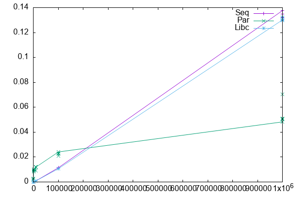
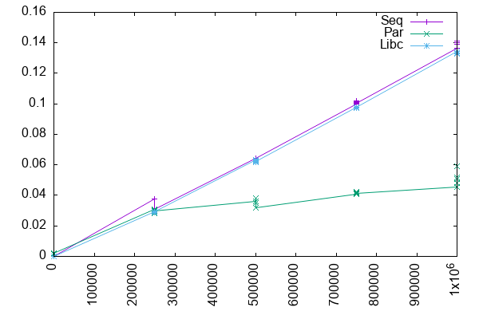

# Lecture 3

let's try to compile and run the project.

```shell
# I'm in the root directory of the project.
mkdir data/ryuhei_2024-10-17
make -C src/
# output:
# cc   -g -Wall -Wshadow -Wcast-align -Waggregate-return -Wmissing-prototypes -Wmissing-declarations -Wstrict-prototypes -Wmissing-prototypes -Wmissing-declarations -Wmissing-noreturn -Wpointer-arith -Wwrite-strings -finline-functions -O0 -pthread -lrt -std=c99  -c -o parallelQuicksort.o parallelQuicksort.c
# clang: warning: -lrt: 'linker' input unused [-Wunused-command-line-argument]
# cc   -g -Wall -Wshadow -Wcast-align -Waggregate-return -Wmissing-prototypes -Wmissing-declarations -Wstrict-prototypes -Wmissing-prototypes -Wmissing-declarations -Wmissing-noreturn -Wpointer-arith -Wwrite-strings -finline-functions -O0 -pthread -lrt -std=c99  parallelQuicksort.o  -o parallelQuicksort
# ld: library 'rt' not found
# clang: error: linker command failed with exit code 1 (use -v to see invocation)
# make: *** [parallelQuicksort] Error 1
```

```
# ld: library 'rt' not found
```

I try to disable rt and compile

```diff
- CFLAGS = $(WARNINGS) -pthread -lrt -std=c99 
+ CFLAGS = $(WARNINGS) -pthread -std=c99 
```

```shell
make -C src/
# output:
# cc   -g -Wall -Wshadow -Wcast-align -Waggregate-return -Wmissing-prototypes -Wmissing-declarations -Wstrict-prototypes -Wmissing-prototypes -Wmissing-declarations -Wmissing-noreturn -Wpointer-arith -Wwrite-strings -finline-functions -O0 -pthread -std=c99  parallelQuicksort.o  -o parallelQuicksort

ls src/parallelQuicksort
# output:
# src/parallelQuicksort
```

Follow the `journal.org`

```shell
./src/parallelQuicksort [1000000]
# output:
# zsh: no matches found: [1000000]

./src/parallelQuicksort 1000000
# output:
# Sequential quicksort took: 0.153304 sec.
# Parallel quicksort took: 0.043658 sec.
# Built-in quicksort took: 0.129441 sec.
```

I run the code 5 times in a row as `2024-10-13` report does

```shell
OUTPUT_DIRECTORY=data/`hostname`_`date +%F`
mkdir -p $OUTPUT_DIRECTORY
OUTPUT_FILE=$OUTPUT_DIRECTORY/measurements_`date +%R`.txt

touch $OUTPUT_FILE
for i in 100 1000 10000 100000 1000000; do
    for rep in `seq 1 5`; do
        echo "Size: $i" >> $OUTPUT_FILE;
        ./src/parallelQuicksort $i >> $OUTPUT_FILE;
    done ;
done

ls data/eduroam-054238.grenet.fr_2024-10-17
# measurements_14:42.txt
```

Parse the result using perl script in the project.
```shell
perl scripts/csv_quicksort_extractor.pl
# => doesn't stop so I killed the process.

perl scripts/csv_quicksort_extractor.pl < data/eduroam-054238.grenet.fr_2024-10-17/measurements_14:42\.txt > data/eduroam-054238.grenet.fr_2024-10-17/measurements_14:42\.csv

head -n 2 data/eduroam-054238.grenet.fr_2024-10-17/measurements_14:42.csv
# output:
# Size, Type, Time
# 100, "Sequential", 0.000012
```

```R
> getwd()
[1] "/Users/ryuhei"
> setwd(dir="~/files/documents/03University/Now/M2R-ParallelQuicksort")
> getwd()
[1] "/Users/ryuhei/files/documents/03University/now/M2R-ParallelQuicksort"
> df <- read.csv("data/eduroam-054238.grenet.fr_2024-10-17/measurements_14:42.csv",header=T)
plot(df$Size,df$Time,col=c("red","blue","green")[df$Type])

> df
      Size        Type     Time
1      100  Sequential 0.000012
2      100    Parallel 0.002443
3      100    Built-in 0.000010
4      100  Sequential 0.000011
5      100    Parallel 0.002832
6      100    Built-in 0.000009
7      100  Sequential 0.000010
8      100    Parallel 0.002565
9      100    Built-in 0.000007
10     100  Sequential 0.000009
11     100    Parallel 0.001589
12     100    Built-in 0.000008
13     100  Sequential 0.000008
14     100    Parallel 0.001649
15     100    Built-in 0.000007
16    1000  Sequential 0.000108
17    1000    Parallel 0.010186
18    1000    Built-in 0.000085
19    1000  Sequential 0.000096
20    1000    Parallel 0.009331
21    1000    Built-in 0.000077
22    1000  Sequential 0.000087
23    1000    Parallel 0.009447
24    1000    Built-in 0.000071
25    1000  Sequential 0.000081
26    1000    Parallel 0.008430
27    1000    Built-in 0.000073
28    1000  Sequential 0.000078
29    1000    Parallel 0.009143
30    1000    Built-in 0.000071
31   10000  Sequential 0.000922
32   10000    Parallel 0.011742
33   10000    Built-in 0.000887
34   10000  Sequential 0.000948
35   10000    Parallel 0.009125
36   10000    Built-in 0.000878
37   10000  Sequential 0.000920
38   10000    Parallel 0.011681
39   10000    Built-in 0.000852
40   10000  Sequential 0.000937
41   10000    Parallel 0.012456
42   10000    Built-in 0.000857
43   10000  Sequential 0.000920
44   10000    Parallel 0.012005
45   10000    Built-in 0.000860
46  100000  Sequential 0.011290
47  100000    Parallel 0.024134
48  100000    Built-in 0.010759
49  100000  Sequential 0.011300
50  100000    Parallel 0.021097
51  100000    Built-in 0.010709
52  100000  Sequential 0.011431
53  100000    Parallel 0.023095
54  100000    Built-in 0.010689
55  100000  Sequential 0.011305
56  100000    Parallel 0.022509
57  100000    Built-in 0.010676
58  100000  Sequential 0.011401
59  100000    Parallel 0.024316
60  100000    Built-in 0.010737
61 1000000  Sequential 0.137565
62 1000000    Parallel 0.048407
63 1000000    Built-in 0.129936
64 1000000  Sequential 0.132160
65 1000000    Parallel 0.050859
66 1000000    Built-in 0.129560
67 1000000  Sequential 0.132163
68 1000000    Parallel 0.050082
69 1000000    Built-in 0.129671
70 1000000  Sequential 0.132347
71 1000000    Parallel 0.050461
72 1000000    Built-in 0.132310
73 1000000  Sequential 0.134704
74 1000000    Parallel 0.070259
75 1000000    Built-in 0.131558
> plot(df)
> plot(df$Size,df$Time,col=c("red","blue","green")[df$Type])
> plot(df$Size,df$Time)
> install.packages("ggplot2")
--- Please select a CRAN mirror for use in this session ---
also installing the dependencies ‘colorspace’, ‘utf8’, ‘farver’, ‘labeling’, ‘munsell’, ‘R6’, ‘RColorBrewer’, ‘viridisLite’, ‘fansi’, ‘magrittr’, ‘pillar’, ‘pkgconfig’, ‘cli’, ‘glue’, ‘gtable’, ‘isoband’, ‘lifecycle’, ‘rlang’, ‘scales’, ‘tibble’, ‘vctrs’, ‘withr’

trying URL 'https://mirror.ibcp.fr/pub/CRAN/bin/macosx/big-sur-arm64/contrib/4.4/colorspace_2.1-1.tgz'
Content type 'application/x-gzip' length 2665643 bytes (2.5 MB)
==================================================
downloaded 2.5 MB

trying URL 'https://mirror.ibcp.fr/pub/CRAN/bin/macosx/big-sur-arm64/contrib/4.4/utf8_1.2.4.tgz'
Content type 'application/x-gzip' length 206910 bytes (202 KB)
==================================================
downloaded 202 KB

trying URL 'https://mirror.ibcp.fr/pub/CRAN/bin/macosx/big-sur-arm64/contrib/4.4/farver_2.1.2.tgz'
Content type 'application/x-gzip' length 1968704 bytes (1.9 MB)
==================================================
downloaded 1.9 MB

trying URL 'https://mirror.ibcp.fr/pub/CRAN/bin/macosx/big-sur-arm64/contrib/4.4/labeling_0.4.3.tgz'
Content type 'application/x-gzip' length 61494 bytes (60 KB)
==================================================
downloaded 60 KB

trying URL 'https://mirror.ibcp.fr/pub/CRAN/bin/macosx/big-sur-arm64/contrib/4.4/munsell_0.5.1.tgz'
Content type 'application/x-gzip' length 246540 bytes (240 KB)
==================================================
downloaded 240 KB

trying URL 'https://mirror.ibcp.fr/pub/CRAN/bin/macosx/big-sur-arm64/contrib/4.4/R6_2.5.1.tgz'
Content type 'application/x-gzip' length 83197 bytes (81 KB)
==================================================
downloaded 81 KB

trying URL 'https://mirror.ibcp.fr/pub/CRAN/bin/macosx/big-sur-arm64/contrib/4.4/RColorBrewer_1.1-3.tgz'
Content type 'application/x-gzip' length 53324 bytes (52 KB)
==================================================
downloaded 52 KB

trying URL 'https://mirror.ibcp.fr/pub/CRAN/bin/macosx/big-sur-arm64/contrib/4.4/viridisLite_0.4.2.tgz'
Content type 'application/x-gzip' length 1297629 bytes (1.2 MB)
==================================================
downloaded 1.2 MB

trying URL 'https://mirror.ibcp.fr/pub/CRAN/bin/macosx/big-sur-arm64/contrib/4.4/fansi_1.0.6.tgz'
Content type 'application/x-gzip' length 383060 bytes (374 KB)
==================================================
downloaded 374 KB

trying URL 'https://mirror.ibcp.fr/pub/CRAN/bin/macosx/big-sur-arm64/contrib/4.4/magrittr_2.0.3.tgz'
Content type 'application/x-gzip' length 233519 bytes (228 KB)
==================================================
downloaded 228 KB

trying URL 'https://mirror.ibcp.fr/pub/CRAN/bin/macosx/big-sur-arm64/contrib/4.4/pillar_1.9.0.tgz'
Content type 'application/x-gzip' length 652058 bytes (636 KB)
==================================================
downloaded 636 KB

trying URL 'https://mirror.ibcp.fr/pub/CRAN/bin/macosx/big-sur-arm64/contrib/4.4/pkgconfig_2.0.3.tgz'
Content type 'application/x-gzip' length 18450 bytes (18 KB)
==================================================
downloaded 18 KB

trying URL 'https://mirror.ibcp.fr/pub/CRAN/bin/macosx/big-sur-arm64/contrib/4.4/cli_3.6.3.tgz'
Content type 'application/x-gzip' length 1387553 bytes (1.3 MB)
==================================================
downloaded 1.3 MB

trying URL 'https://mirror.ibcp.fr/pub/CRAN/bin/macosx/big-sur-arm64/contrib/4.4/glue_1.8.0.tgz'
Content type 'application/x-gzip' length 173700 bytes (169 KB)
==================================================
downloaded 169 KB

trying URL 'https://mirror.ibcp.fr/pub/CRAN/bin/macosx/big-sur-arm64/contrib/4.4/gtable_0.3.5.tgz'
Content type 'application/x-gzip' length 218293 bytes (213 KB)
==================================================
downloaded 213 KB

trying URL 'https://mirror.ibcp.fr/pub/CRAN/bin/macosx/big-sur-arm64/contrib/4.4/isoband_0.2.7.tgz'
Content type 'application/x-gzip' length 1869352 bytes (1.8 MB)
==================================================
downloaded 1.8 MB

trying URL 'https://mirror.ibcp.fr/pub/CRAN/bin/macosx/big-sur-arm64/contrib/4.4/lifecycle_1.0.4.tgz'
Content type 'application/x-gzip' length 124785 bytes (121 KB)
==================================================
downloaded 121 KB

trying URL 'https://mirror.ibcp.fr/pub/CRAN/bin/macosx/big-sur-arm64/contrib/4.4/rlang_1.1.4.tgz'
Content type 'application/x-gzip' length 1903020 bytes (1.8 MB)
==================================================
downloaded 1.8 MB

trying URL 'https://mirror.ibcp.fr/pub/CRAN/bin/macosx/big-sur-arm64/contrib/4.4/scales_1.3.0.tgz'
Content type 'application/x-gzip' length 710409 bytes (693 KB)
==================================================
downloaded 693 KB

trying URL 'https://mirror.ibcp.fr/pub/CRAN/bin/macosx/big-sur-arm64/contrib/4.4/tibble_3.2.1.tgz'
Content type 'application/x-gzip' length 688886 bytes (672 KB)
==================================================
downloaded 672 KB

trying URL 'https://mirror.ibcp.fr/pub/CRAN/bin/macosx/big-sur-arm64/contrib/4.4/vctrs_0.6.5.tgz'
Content type 'application/x-gzip' length 1891441 bytes (1.8 MB)
==================================================
downloaded 1.8 MB

trying URL 'https://mirror.ibcp.fr/pub/CRAN/bin/macosx/big-sur-arm64/contrib/4.4/withr_3.0.1.tgz'
Content type 'application/x-gzip' length 223579 bytes (218 KB)
==================================================
downloaded 218 KB

trying URL 'https://mirror.ibcp.fr/pub/CRAN/bin/macosx/big-sur-arm64/contrib/4.4/ggplot2_3.5.1.tgz'
Content type 'application/x-gzip' length 4974305 bytes (4.7 MB)
==================================================
downloaded 4.7 MB


The downloaded binary packages are in
	/var/folders/dc/4s_q9l5j1fg7f8ymr6mp8n1c0000gn/T//Rtmpxv7gKK/downloaded_packages
> library(ggplot2)
> str(df)
'data.frame':	75 obs. of  3 variables:
 $ Size: int  100 100 100 100 100 100 100 100 100 100 ...
 $ Type: chr  " Sequential" " Parallel" " Built-in" " Sequential" ...
 $ Time: num  0.000012 0.002443 0.00001 0.000011 0.002832 ...
> ggplot(df,aes(x=Size,y=Time,color=Type)) + geom_point()
> 
# I saved the image
# as `data/eduroam-054238.grenet.fr_2024-10-17/measurements_14:42.pdf`
```

I'm following the "A simple plot with gnuplot" section...


```shell
FILENAME="data/eduroam-054238.grenet.fr_2024-10-17/measurements_14:42"
perl scripts/csv_quicksort_extractor2.pl < "$FILENAME.txt" > "${FILENAME}_wide.csv"
echo "
set terminal png size 600,400 
set output '${FILENAME}_wide.png'
set datafile separator ','
set key autotitle columnhead
plot '${FILENAME}_wide.csv' using 1:2 with linespoints, '' using 1:3 with linespoints, '' using 1:4 with linespoints
" | gnuplot
```

I got the result image!!!

# Additional Experiments (expand the size)
I try some additional experiments.

## Run experiments

```shell
OUTPUT_DIRECTORY=data/`hostname`_`date +%F`
mkdir -p $OUTPUT_DIRECTORY
OUTPUT_FILE=$OUTPUT_DIRECTORY/measurements_`date +%R`.txt

touch $OUTPUT_FILE
for i in $(seq 100 100 10000); do
    for rep in `seq 1 5`; do
        echo "Size: $i" >> $OUTPUT_FILE;
        ./src/parallelQuicksort $i >> $OUTPUT_FILE;
    done ;
done

ls data/eduroam-054238.grenet.fr_2024-10-17/measurements_15:07.txt
# output:
# data/eduroam-054238.grenet.fr_2024-10-17/measurements_15:07.txt
```

## Plot the results

```shell
FILENAME="data/eduroam-054238.grenet.fr_2024-10-17/measurements_15:07"
perl scripts/csv_quicksort_extractor2.pl < "$FILENAME.txt" > "${FILENAME}_wide.csv"
echo "
set terminal png size 600,400 
set output '${FILENAME}_wide.png'
set datafile separator ','
set key autotitle columnhead
plot '${FILENAME}_wide.csv' using 1:2 with linespoints, '' using 1:3 with linespoints, '' using 1:4 with linespoints
" | gnuplot
```

Run some small case before trying the large experiments

```shell
OUTPUT_DIRECTORY=data/`hostname`_`date +%F`
mkdir -p $OUTPUT_DIRECTORY
OUTPUT_FILE=$OUTPUT_DIRECTORY/measurements_`date +%R`.txt

touch $OUTPUT_FILE
for i in 100 250000 500000 750000 1000000; do
    for rep in `seq 1 5`; do
        echo "Size: $i" >> $OUTPUT_FILE;
        ./src/parallelQuicksort $i >> $OUTPUT_FILE;
    done ;
done

ls data/eduroam-054238.grenet.fr_2024-10-17/measurements_15:37.txt
# output:
# data/eduroam-054238.grenet.fr_2024-10-17/measurements_15:37.txt

FILENAME="data/eduroam-054238.grenet.fr_2024-10-17/measurements_15:37"
perl scripts/csv_quicksort_extractor2.pl < "$FILENAME.txt" > "${FILENAME}_wide.csv"
echo "
set terminal png size 600,400 
set output '${FILENAME}_wide.png'
set datafile separator ','
set key autotitle columnhead
plot '${FILENAME}_wide.csv' using 1:2 with linespoints, '' using 1:3 with linespoints, '' using 1:4 with linespoints
" | gnuplot
```

I got this image.


I want to make x-axis more readable.

```shell
FILENAME="data/eduroam-054238.grenet.fr_2024-10-17/measurements_15:37"
perl scripts/csv_quicksort_extractor2.pl < "$FILENAME.txt" > "${FILENAME}_wide.csv"
echo "
set terminal png size 600,400 
set output '${FILENAME}_wide.png'
set datafile separator ','
set key autotitle columnhead
set xtics rotate by 90 right
plot '${FILENAME}_wide.csv' using 1:2 with linespoints, '' using 1:3 with linespoints, '' using 1:4 with linespoints
" | gnuplot
```

I got this image.


```R
plot(df$Size,df$Time,col=c("red","blue","green")[as.factor(df$Type)])
```

```shell
FILENAME="data/eduroam-054238.grenet.fr_2024-10-17/measurements_15:37"
perl scripts/csv_quicksort_extractor2.pl < "$FILENAME.txt" > "${FILENAME}_wide.csv"
echo "
set terminal png size 800,600 
set output '${FILENAME}_wide3.png'
set datafile separator ','
set key autotitle columnhead
set xlabel 'Size'
set ylabel 'Time'
set errorbars large linecolor black linewidth 0.5 dashtype '.'
set grid
set xtics rotate by 90 right
plot '${FILENAME}_wide.csv' using 1:2 with linespoints, '' using 1:3 with linespoints, '' using 1:4 with linespoints
" | gnuplot
open data/eduroam-054238.grenet.fr_2024-10-17/measurements_15:37_wide3.png
```

- Imagine all the bad thing before doing experiments
- Randomize the trials

- device
    - OS
    - application version (s)
    - libraries (ggplot)
- order